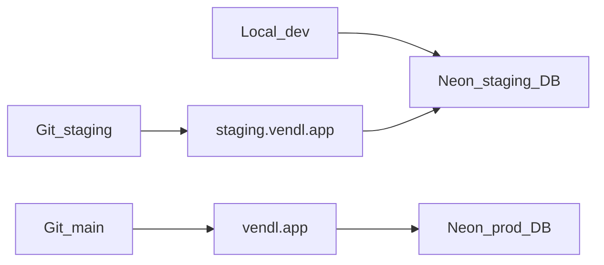

# New Developer Guide

Day-one and every-day playbook for contributing to Vendl (repo: [silicondalesaustralia/stallside](https://github.com/silicondalesaustralia/stallside)).

Work on the **`staging`** branch and the **staging** Postgres database only. Do not push to `main` or touch production data unless a teammate with production access is running an explicit release.

For staging infrastructure details, see [`VENDL-STAGING.md`](../VENDL-STAGING.md). For stack and agent notes, see [`README.md`](../README.md) and [`AGENT-HANDOFF.md`](../AGENT-HANDOFF.md).

## Branches

| Git branch | App | Database |
|------------|-----|----------|
| `staging` | [https://staging.vendl.app](https://staging.vendl.app) | Neon **staging** Postgres |
| `main` | [https://vendl.app](https://vendl.app) | Neon **production** Postgres |

```text
main     = production
staging  = what staging.vendl.app serves
```

## One-time setup

1. Clone and check out staging:

   ```bash
   git clone git@github.com:silicondalesaustralia/stallside.git
   cd stallside
   git checkout staging
   ```

2. Install dependencies:

   ```bash
   npm install
   ```

3. Copy env and configure **staging** DB only:

   ```bash
   cp .env.example .env
   ```

   Ask the team for the Neon **staging** connection strings (not production):

   - `DATABASE_URL` — pooled URL (app runtime)
   - `DIRECT_DATABASE_URL` — direct / non-pooler URL (migrations)

   Also set at least `AUTH_SECRET`. For local host behaviour that matches staging, you may set:

   ```text
   VENDL_HOST_ENV=staging
   NEXT_PUBLIC_APP_URL=http://localhost:3000
   AUTH_URL=http://localhost:3000
   ```

4. Apply migrations and start the app:

   ```bash
   npx prisma migrate deploy
   npm run dev
   ```

5. Open [http://localhost:3000](http://localhost:3000). Without `RESEND_API_KEY`, magic links print in the server console.

## Daily startup (required before any work)

Every day (and before starting a new task), rebase your local `staging` onto the remote:

```bash
git checkout staging
git fetch origin
git pull --rebase origin staging
```

If rebase conflicts appear, resolve them, then:

```bash
git add .
git rebase --continue
```

Rules:

- Do **not** start feature work on a stale local `staging`.
- Do **not** rebase onto or merge from `main` as a daily habit. That is only for preparing a production release.

## Push policy

- Push **only** to `origin/staging`:

  ```bash
  git push origin staging
  ```

- **Never** push to `main` / production.
- After a push, Vercel builds and deploys to [https://staging.vendl.app](https://staging.vendl.app).
- Promoting to production (`staging` → `main`) is a separate, explicit step — not routine for new contributors.

If you have local commits and the remote moved, prefer rebase then push:

```bash
git pull --rebase origin staging
git push origin staging
```

## How Postgres works here

The app uses **PostgreSQL** on **Neon**, accessed through **Prisma 7**.

| Env var | Role |
|---------|------|
| `DATABASE_URL` | Runtime (pooled Neon URL is fine) |
| `DIRECT_DATABASE_URL` | Migrations (direct / non-pooler URL preferred) |

- Schema: `prisma/schema.prisma`
- Migrations: `prisma/migrations/`
- App client: `src/lib/prisma.ts`
- Vercel production/staging builds run `npm run build:vercel`, which runs `prisma migrate deploy` then `next build`



Local development and `staging.vendl.app` share the **same Neon staging database**. Production uses a separate Neon database. Never point local or staging env at production.

## Hard rules

1. Local `.env` must use the **staging** Neon URLs only.
2. Never run seeds, backfills, or migrations against production unless explicitly asked and you have confirmed the host in the connection string.
3. Before `db:migrate`, seeds, or destructive scripts, check that the URL host looks like staging (not the production Neon host).
4. Prefer Stripe / PayPal **test / sandbox** keys on staging and local.
5. Do not register production payment webhooks against staging unless intentional.

## Useful commands

```bash
npm run dev                 # local Next.js
npm run db:generate         # prisma generate
npm run db:migrate          # prisma migrate dev (creates migrations; needs DIRECT_DATABASE_URL)
npm run db:studio           # Prisma Studio against DATABASE_URL
npx prisma migrate deploy   # apply pending migrations (safe default for day-to-day)
npm run seed:green-valley-demo
npm run lint
```

Seeds and scripts in `scripts/` use whatever is in your `.env`. Confirm staging before running them.

## Further reading

- [`VENDL-STAGING.md`](../VENDL-STAGING.md) — staging domain, Neon split, Vercel env
- [`README.md`](../README.md) — stack and local overview
- [`AGENT-HANDOFF.md`](../AGENT-HANDOFF.md) — deeper product/stack notes
- [`PILOT-GO-LIVE.md`](../PILOT-GO-LIVE.md) — production go-live (not day-to-day work)
