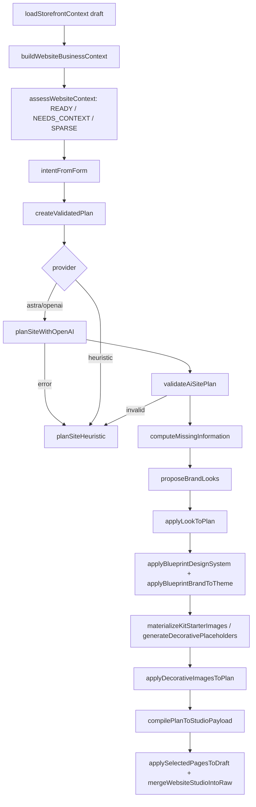

# Website section and website builder: handover

Branch: `feature/social-kit`. The whole feature was ported from `staging` in commit `5fcf523`; the tests and this doc came in the commit after it. All paths are relative to the repo root.

This doc covers the dashboard **Website** sidebar menu (Web Studio, Pages, Commerce, Navigation, Blog, SEO, Domains, QR codes), the drag-and-drop page editor, the AI website builder, the public seller website at `/shop/[slug]`, and seller subdomains and custom domains.

Read the first section before changing anything.

---

## 0. Read this first

1. **The database tables have no migrations on this branch.** `prisma/schema.prisma` defines `Storefront`, `StorefrontDomain`, `DomainPurchase`, `QrCode`, the enums `StorefrontDomainType`, `StorefrontDomainStatus`, `DomainPurchaseStatus` and `StandQrLinkMode`, and the columns `Stand.qrLinkMode` / `Stand.qrCategoryId`. **No file in `prisma/migrations` creates them.**
   - Staging has 16 migrations (`20260901050000_owner_business_mode_onboarding` … `20260911120000_storefront_favicon`) that create these tables and a lot of other staging-only schema.
   - They were deliberately left out, because `build:vercel` runs `scripts/migrate-deploy-retry.js`. If the preview's `DATABASE_URL` pointed at production, the build would apply all of that schema to production.
   - **Before testing, confirm which database the `feature/social-kit` preview uses.** If it's the staging database, the tables already exist. Before merging to `main`, write one migration that creates only the website tables, columns and enums (copy the relevant SQL from the staging migrations), and check it against production.
2. **Everything lives in one JSON blob per owner.** `Storefront.draftConfig` holds the whole site: page layouts, pages list, navigation, blog, SEO and redirects. **Publish copies the entire draft to `publishedConfig`.** Every Publish button in every sub-section publishes all pending changes across the whole site. See section 3.
3. **Some edits go live without publishing.** Storefront columns (headline, about, slug, hero image, favicon, contact email), owner and stand logo and colours, `Product.seoTitle/seoDescription`, and blog post publish/unpublish all go live as soon as they're saved.
4. **No concurrency control.** Every server action reads the whole JSON, changes one key and writes it back. Two tabs, or the header-style auto-save racing a layout save, can lose writes.
5. **The AI builder overwrites seller branding** (owner and stand colours, plus the hero image). See section 6.6.
6. **Tests:** `npm run test:website` runs 99 tests across 14 files, all passing. `NEXT_PUBLIC_STOREFRONT_SUBDOMAIN_PRIMARY=0` is set in that script because one test (`studio.test.ts` › breadcrumbs) predates the switch to subdomain URLs.

---

## 1. Map of the code

| Area | Dashboard routes (`src/app/dashboard/(gated)/website/…`) | Libraries | Components |
|---|---|---|---|
| Web Studio hub | `web-studio/page.tsx`, `page.tsx`, `details/`, `basics/`, `branding/`, `ai/`, `studio/`, `studio/templates/`, `actions.ts` | `src/lib/website/web-studio-nav.ts`, `src/lib/storefront/*` | `src/components/website/WebStudio*.tsx`, `FontPair*.tsx` |
| Page editor (Studio) | `studio/actions.ts`, `pages/[pageId]`, `commerce/[kind]` | `src/lib/studio/*` | `src/components/studio/**` |
| AI builder | `ai/actions.ts` | `src/lib/website-ai/*`, `src/lib/website/{blueprints,demo-kits,brand-looks,brand-fonts}*` | `src/components/website-ai/**` |
| Pages | `pages/**` | `src/lib/studio/custom-pages.ts`, `custom-page-paths.ts`, `page-starters.tsx`, `builtin-pages.tsx` | — |
| Commerce layouts | `commerce/**` | `src/lib/studio/commerce-pages.ts`, `commerce-starters.tsx`, `commerce-context.ts` | `StudioCommerceEditor` |
| Navigation | `navigation/**` | `src/lib/studio/navigation.ts` | `navigation/*Editor.tsx` |
| Blog | `blog/**` | `src/lib/studio/blog.ts`, `load-blog.ts` | `blog/BlogPostForm.tsx` |
| SEO and redirects | `seo/**` | `src/lib/studio/seo-settings.ts`, `resolve-seo-metadata.ts`, `redirects.ts`, `apply-redirects.ts` | `seo/SeoSettingsForm.tsx` |
| Domains | `domains/**` | `src/lib/domains/**` | `domains/*.tsx` |
| QR codes | `qr/**` | `src/lib/stand-qr.ts` | `qr/**`, reuses `businesses/[standId]/qr/QrSignSheet.tsx` |
| Tenancy (hosts) | — | `src/middleware.ts`, `src/lib/tenancy/**`, `src/app/api/tenancy/host-lookup/route.ts` | — |
| Public site | `src/app/shop/[slug]/**` | `src/lib/storefront/page-loader.ts`, `src/lib/catalogue/storefront.ts`, `src/lib/studio/public-*.ts*` | `src/components/storefront/**`, `src/components/studio/shell/**`, `src/components/studio/blocks/**` |
| Experiments (spikes) | `puck-spike/`, `craft-spike/`, `src/app/shop/[slug]/{puck,craft}-preview` | `src/lib/puck/**`, `src/lib/craft/**` | `src/components/puck/**`, `src/components/craft/**` |

### Sidebar and navigation (added on this branch, not from staging)

- `src/components/dash-nav-links.ts`: `websiteLink`, `WEBSITE_HUB_NAV` (the 8 sub-sections), `HubNavItem`, `hubNavItemActive()`. Web Studio is active for `/dashboard/website`, `details`, `basics`, `branding`, `ai`, `studio`, `craft-spike` and `puck-spike` (`WEB_STUDIO_PREFIXES`).
- `src/components/SidebarWebsiteMenu.tsx`: desktop sidebar item. Expands to the sub-sections while you're inside `/dashboard/website`.
- `src/components/website/WebsiteMobileSubnav.tsx`, rendered by `website/layout.tsx`: scrollable tabs, mobile only (`md:hidden`).
- `DashboardMobileNav.tsx`: Website is the first entry in the "More" menu.
- `DashNavIcon.tsx`: globe icon keyed on `/dashboard/website/web-studio`.

Staging uses a different nav (`primaryNavForMode`, `DashHubSubnav` in `AppShell`). That wasn't ported.

### Dependencies

- `@craftjs/core ^0.2.12`: the page editor.
- `@puckeditor/core 0.21.3`: only the Puck spike needs it, but a few Puck files are shared (section 4.5).
- `@craftjs/utils` (`ROOT_NODE`) is imported in `src/lib/studio/page-canvas.ts` and `public-render.tsx`, but it's only a transitive dependency. Add it to `package.json` if it ever goes missing.
- `@vercel/blob` (uploads), `qrcode`, `undici` (Namecheap proxy), `zod`.

### Next.js 16 note

`src/middleware.ts` uses the old file name. Next 16 renamed Middleware to **Proxy** (`proxy.ts`), and behaviour is unchanged; see `node_modules/next/dist/docs/01-app/01-getting-started/16-proxy.md`. The build output lists it as "Proxy (Middleware)". Per `AGENTS.md`, read `node_modules/next/dist/docs/` before writing Next code.

---

## 2. Data model

### Prisma (`prisma/schema.prisma`)

**`Storefront`.** One per owner (`ownerId @unique`).

| Field | Notes |
|---|---|
| `slug` (unique) | Path `/shop/{slug}` and subdomain `{slug}.vendl.app` |
| `isPublished`, `publishedAt` | If not published, every public route returns 404 (except owner draft preview) |
| `headline` (shown as "Shop name"), `subheadline`, `about`, `heroImageUrl`, `faviconUrl`, `themePreset` (default `"market"`), `contactEmail`, `showPhone` | **Columns, live as soon as saved** |
| `draftConfig Json @default("{}")` | Working copy of the whole site |
| `publishedConfig Json?` | Snapshot taken on publish |
| `customDomain String?` | Legacy, unused; replaced by `StorefrontDomain` |

**`StorefrontDomain`.** Maps a hostname to a storefront.
- `hostname @unique`, `type` (`VENDL_SUBDOMAIN | CUSTOM`), `status` (`PENDING | VERIFYING | ACTIVE | ERROR | DISCONNECTED`), `isPrimary`.
- Cloudflare fields: `cloudflareCustomHostnameId`, `hostnameStatus`, `sslStatus`, `verification*`, `cnameTarget`, `errorCode/errorMessage`.
- `VENDL_SUBDOMAIN` rows are **never created in code**, only updated: slug sync in `saveStorefrontDraftData`, and the restore in `disconnectCustomDomain`. Subdomain routing doesn't need them, because middleware works from the slug alone.

**`DomainPurchase`.** A domain bought through Namecheap.
- `status`: `AWAITING_PAYMENT → PAID → REGISTERING → REGISTERED → CONNECTING → ACTIVE`, or `FAILED / REFUNDED / CANCELLED`.
- Also stores a registrant JSON snapshot, prices in cents, and `storefrontDomainId`.

**`QrCode`.** Extra QR posters.
- Fields: `ownerId`, `standId`, `name`, `linkMode` (default `WEBSITE_CATEGORY`), `categoryId?`.
- Each business's main QR uses `Stand.qrLinkMode` (default `WEBSITE_HOME`) and `Stand.qrCategoryId` instead.

`Category.showOnWebsite = false` hides a category from the website's nav and pickers, but `/shop/{slug}/shop/{cat}` still resolves so printed QR codes keep working.

### `draftConfig` / `publishedConfig` keys

Untyped JSON. Each feature owns one key and has `extractX(raw)` / `mergeXIntoRaw(raw, …)` helpers that spread the existing object and replace only their own key.

| Key | Type / owner | Purpose |
|---|---|---|
| `websiteStudio` | `StudioPayload` (`src/lib/studio/types.ts`) | **All page layouts** (section 4) |
| `customPages` | `StorefrontCustomPage[]` (`src/lib/studio/custom-pages.ts`) | Page list: built-in and custom pages, nav and footer flags |
| `themeOverrides` | `StorefrontThemeOverrides` (`src/lib/storefront/types.ts`) | `accentColor`, `secondaryColor`, `buttonStyle`, `paletteId`, `fontPairId`, `headerLayout` (`classic\|centred\|stacked\|minimal`), `brandMark` (`logo-and-name\|logo-only\|name-only`) |
| `pages.{home,shop,about,contact}.enabled` | Legacy `StorefrontConfig` (`parseStorefrontConfig` in `src/lib/storefront/config.ts`) | **Still gates** home, `/shop`, `/about` and `/contact` |
| `sections`, `featuredProductIds`, `galleryImages` | Legacy | Only used by the old non-Studio homepage |
| `blogSettings`, `blogTopics`, `blogPosts` | `src/lib/studio/blog.ts` | Blog (posts are stored here, not in tables) |
| `storefrontSeo` | `src/lib/studio/seo-settings.ts` | `{ home, entities: { "page:id" \| "blog:id" \| "product:id" \| "category:id" \| "menu:id" } }` |
| `storefrontRedirects` | `src/lib/studio/redirects.ts` | URL redirects |
| `websiteAiScaffold` | `src/lib/website-ai/scaffold-storage.ts` | Temporary AI builder state (version 1), deleted after a build |
| `initialBlueprintId` | AI builder | Written, never read |
| `craftSpike` | `src/lib/craft/types.ts` | Legacy experiment data; **still read as a fallback**, including on public pages |
| `puckSpike` | `src/lib/puck/types.ts` | Puck experiment only |

---

## 3. Draft, preview and publish

- **Creating the storefront.** `ensureStorefront()` (`src/lib/catalogue/storefront.ts`) creates it, or seeds a default `draftConfig`, the first time any website action runs. The seed (`src/lib/website/persistence/seed-draft.ts`) copies the business name, short description, logo and brand colours into `draftConfig.identity` / `themeOverrides`.
- **Website identity lives in the draft.** Headline, subheadline, about, contact email, show-phone, logo, favicon and hero are stored in `draftConfig.identity` and overlaid on the storefront columns (`src/lib/storefront/identity.ts`). Website edits never write back to the owner/stand. On publish, identity is mirrored to the storefront columns.
- **Saving.** Every dashboard action calls `requireOwnerWrite()` (an alias of `requireOwner()`, so admin login-as can write), changes one key in `draftConfig`, calls `revalidatePath`, and most then `redirect()` with `?saved=1` or `?published=1`.
- **Revision guard.** Every draft write goes through `writeStorefrontDraft` (`src/lib/website/persistence/draft-store.ts`), which only succeeds if `Storefront.draftRevision` still matches the revision the caller read, then increments it. Form actions redirect with `?error=conflict` (`writeDraftOrRedirect`); the Studio editors return `{ ok: false, error: "conflict" }` and show a "Reload latest version" bar.
- **Publishing.** `publishStorefront(ownerId, userId)` in `src/lib/website/persistence/publish.ts` refuses to publish while any public section still holds instructional copy ("Tell customers …"), then, in one transaction, writes an immutable `StorefrontPublication` snapshot and sets `isPublished`, `publishedConfig`, `publishedAt` and `activePublicationId`. Callers: `publishWebsiteStudioDraft`, `publishCustomPageDraft`, `publishCommerceLayoutDraft`, `publishStorefrontAction`, `publishAiWebsiteDraft`. The spike "publish" actions only save. There is no per-page publish.
- **History.** Web Studio → Details lists the last 10 publications; "Restore as draft" copies a snapshot back into the draft (it does not go live until published).
- **Public visibility.** `isPublicStudioNode` (`src/lib/studio/node-visibility.ts`) hides hidden, `EDITOR_ONLY` and not-live placeholder (`SETUP_STUB`, `POLICY_VARIABLE`) sections on the public site.
- **Exceptions that patch `publishedConfig` directly:**
  - `publishStorefrontRedirects` copies only `storefrontRedirects`. It does not set `isPublished`.
  - Blog `publishBlogPost` / `unpublishBlogPost` / `deleteBlogPost` call `syncPublishedPost`, which patches only `publishedConfig.blogPosts`, and only if the site is already published.
- **Unpublishing.** `unpublishStorefront` sets `isPublished = false` and keeps the snapshot.
- **Draft preview.** Add `?draft=1` to any public URL. It needs a signed-in session whose owner owns this storefront, otherwise 404 (`loadStorefrontPage`, `src/lib/storefront/page-loader.ts`).
  - The query param is the only thing that keeps draft mode while clicking around; link helpers in `src/lib/storefront/paths.ts` add it.
  - Dashboard preview links use the path form on the app host: `appBaseUrl()/shop/<slug>/studio-preview?draft=1`.

---

## 4. The page editor (Studio)

### 4.1 Payload

```ts
// src/lib/studio/types.ts
export const STUDIO_VERSION = 2 as const;
export type StudioTemplateId = "artisan" | "farmhouse" | "market";
export type StudioPayload = {
  version: typeof STUDIO_VERSION;
  engine: "craft";
  templateId: StudioTemplateId;
  nodes: SerializedNodes;                       // homepage
  pageNodes?: Record<string, SerializedNodes>;  // every other page
};
```

`nodes` is Craft.js `SerializedNodes`, a flat map of id to `{ type: { resolvedName }, props, nodes: childIds, parent, isCanvas, displayName, custom, hidden, linkedNodes }`.
- The root is `ROOT`, with resolvedName `CraftPageRoot`, and sections are its children.
- AI-compiled trees attach sections straight to `"ROOT"`. `findStudioCanvasParentId` (`page-canvas.ts`) handles both shapes.

**`pageNodes` keys:**

| Page | Key |
|---|---|
| Home | `"home"` (`STUDIO_HOME_PAGE_KEY`); same tree as `nodes` |
| Built-in pages | `builtin-about`, `builtin-contact`, `builtin-privacy`, `builtin-terms`, `builtin-returns`, `builtin-shipping`, `builtin-blog` (intro sections above the blog index) |
| Custom pages | `StorefrontCustomPage.id`, a UUID (so renaming the slug is safe) |
| Commerce layouts | `commerce-shop`, `commerce-category`, `commerce-product`, `commerce-menu` |
| AI FAQ page | `ai-faq` |
| Green Valley demo variants | `__demo_farmhouse`, `__demo_market` |

**Storage helpers** (`src/lib/studio/storage.ts`):
- `extractWebsiteStudio(raw)` returns the payload only if `version === 2 && engine === "craft"`, and backfills `home` ↔ `nodes`.
- `extractStudioFromDraft(raw)` falls back to the legacy `craftSpike` data.
- `readStudioFromStorefrontJson(draft, usePublished, published)` is what public pages use.
- `studioPageNodes(studio, key)`.
- `mergeWebsiteStudioIntoRaw(raw, templateId, nodes, pageNodes?)` saves the homepage.
- `mergeWebsiteStudioPageIntoRaw(raw, templateId, pageKey, nodes)` saves one page.
- `clearHeroDecorativeFromDraftRaw`.
- `defaultTemplateId(stored, businessMode)`: `farmhouse` for `FARM_STAND`/`BOTH`, `artisan` otherwise.

**Validation.** `validateStudioNodes` (`validate-state.ts`) only checks that each node's `resolvedName` is in `STUDIO_RESOLVER_NAMES`. **It doesn't check props or structure.** Client-supplied props are stored as-is.

### 4.2 Editor component tree

```
StudioEditor (homepage) | StudioPageEditor | StudioCommerceEditor | StudioPreviewEditor
  └─ next/dynamic(..., { ssr: false }) → StudioEditorInner
       └─ StudioEditorProvider (re-exports src/components/craft/CraftEditorContext.tsx)
            └─ <Editor resolver={studioResolver} onNodesChange=…>
                 StudioEditorHeader    viewport, undo/redo, Save draft, Publish, template link
                 StudioSectionPalette  left; click or drag to add
                 StudioEditorShell     themed nav and footer around the canvas
                   └─ <Frame data={initialNodes}>{starterTree}</Frame>
                   └─ StudioPageAddFooter
                 StudioSettingsPanel   right; per-section props, or HeaderStyleSettings
                 StudioAddSectionModal
```

| Wrapper | Used by |
|---|---|
| `StudioEditor` | `WebStudioLayoutPanel` (Web Studio → "4 · Edit layout") |
| `StudioPageEditor` | `pages/[pageId]/page.tsx` |
| `StudioCommerceEditor` | `commerce/[kind]/page.tsx`, with sample data from `buildSampleCommerceContext` |
| `StudioPreviewEditor` | `/shop/[slug]/studio-preview?draft=1&edit=1` (editing inside the live page shell) |

- **Loading.** The server page passes the stored nodes. If nothing is stored, `Frame` renders a starter React tree:
  - `buildStudioStarterTree` (`starter-composition.tsx`) for the homepage, one per template;
  - `buildCustomPageStarterTree` (`page-starters.tsx`) for custom pages;
  - `buildCommerceStarterTree` (`commerce-starters.tsx`) for commerce layouts.
  
  Starters are not saved until the owner clicks Save.
- **Saving.** `onNodesChange` stores `query.serialize()` in a ref. Save then calls one of three actions:
  - `saveCommerceLayoutDraft(kind, json)` on commerce layouts;
  - `saveCustomPageDraft(pageId, json)` on pages;
  - `saveWebsiteStudioDraft(json, templateId, returnTo)` on the homepage.
  
  Publish calls the matching `publish*` action. Each one validates, merges, revalidates and redirects.
- **Header style.** `HeaderStyleSettings.tsx` saves through `saveStorefrontHeaderStyle` **immediately**, outside the layout save, into `themeOverrides.headerLayout/brandMark`.
- **Inline text.** `InlineEditableText.tsx` uses `contentEditable` and `useNode().actions.setProp`, and commits on blur.
- **Section chrome.** `src/components/craft/CraftSectionChrome.tsx` provides move up/down, duplicate, delete and "+ Add section". Its rules come from `studioSectionRule()` when `registryMode === "studio"`.

### 4.3 Templates and design tokens

- `src/lib/studio/templates.ts`: `STUDIO_TEMPLATES` (`artisan`, `farmhouse`, `market`). Each has a CSS class (`studio-template-*`), CSS-variable styles, `themePreset`, header and footer variants, and recommended business modes.
- `design-tokens.ts`: `TEMPLATE_TOKENS` (`--site-*`, `--studio-section-py`, `--radius-card`, …) and `tokensToStyle()`. The CSS that consumes them lives in `src/app/globals.css`.
- `preset-registry.ts`: per-template preset lists (`HERO_PRESETS`, `PRODUCT_PRESETS`, `CATEGORY_PRESETS`, `NEXT_DROP_PRESETS`) and the mappers `mapProductPreset` / `mapCategoryPreset`. Blocks use the mappers; nothing reads the lists themselves.
- `applyWebsiteStudioTemplate` (`studio/actions.ts`, UI at `studio/templates/page.tsx`) only rewrites `templateId`. Existing sections keep their old presets, which the mappers translate.

### 4.4 Section types (14, plus the root)

| Serialized name | Wrapper location | Render block (`src/components/studio/blocks/`) | Rules |
|---|---|---|---|
| `CraftHeroSection` | `components/craft/sections` | `StudioHeroBlock` | content; singleton, required, home only |
| `CraftProductDetailSection` | `components/studio/sections` | `StudioProductDetailBlock` | sell; singleton, required; product layout only |
| `CraftMenuDetailSection` | studio | `StudioMenuDetailBlock` | sell; singleton, required; menu layout only |
| `CraftProductGridSection` | craft | `StudioProductsBlock` (`source: all\|category\|manual\|activeCategory`, max 12) | sell; duplicable |
| `CraftCategoriesSection` | studio | `StudioCategoriesBlock` | sell; singleton |
| `CraftNextDropSection` | craft | `StudioNextDropBlock` (upcoming menus and pre-orders) | sell; singleton; `FOOD_BUSINESS` / `BOTH` |
| `CraftTextSection` | studio | `StudioTextBlock` | content; duplicable |
| `CraftImageSection` | studio | `StudioImageBlock` | content; duplicable |
| `CraftImageTextSection` | studio | `StudioImageTextBlock` | content; duplicable |
| `CraftAboutSection` | craft | **`PuckAboutBlock`** (`components/puck/blocks`) | trust; singleton |
| `CraftReviewsSection` | studio | `StudioReviewsBlock` | trust; singleton |
| `CraftPickupSection` | studio | `StudioPickupBlock` | trust; singleton |
| `CraftSignupSection` | studio | `StudioSignupBlock` | grow; singleton |
| `CraftFarmStandSection` | studio | `StudioFarmStandBlock` | trust; singleton; `FARM_STAND` / `BOTH` |

The root is `StudioPageRoot`, serialized as `CraftPageRoot`. **In `src/lib/studio/resolver.ts`, `CraftPageRoot` must stay after `StudioPageRoot`.** Craft serializes a component under the last key it finds, and if the order flips every save fails validation.

The rules live in `STUDIO_SECTION_RULES` (`src/lib/studio/section-registry.ts`): category, `paletteOrder`, `singleton`, `required`, `duplicable`, `deletable`, `businessModes`, `commerceKinds`, `homeOnly`. `canInsertStudioSection()` and `paletteSectionsForMode()` enforce them.

### 4.5 Adding a new section type

1. Add `"CraftFooSection"` to `StudioSectionType` (`src/lib/studio/types.ts`). Keep the `Craft*` prefix: the display name, resolver key and serialized name must all match.
2. Add a rule to `STUDIO_SECTION_RULES` (`section-registry.ts`). This also allowlists it for save validation.
3. Create the render block `src/components/studio/blocks/StudioFooBlock.tsx`.
   - Props: plain props plus `metadata: StudioMetadata`, `isEditing?` and `editable?`.
   - Build links with the helpers in `src/lib/storefront/paths.ts`, passing `metadata.basePath` and `metadata.draft`.
   - It must render from a server page.
4. Create the Craft wrapper `src/components/studio/sections/CraftFooSection.tsx` with `useNode`, `connect(drag(dom))` and `<CraftSectionChrome>`, plus a static `CraftFooSection.craft = { displayName: "CraftFooSection", props: {…defaults}, rules: {…} }`.
5. Add it to `studioResolver` (`resolver.ts`).
6. Add a `case` to `studioSectionElement` (`insert-section.tsx`). The compiler enforces this through an exhaustive `never` switch.
7. **Add a `case` to `StudioSectionRender` in `src/lib/studio/public-render.tsx`.** Nothing enforces this, and without it the section silently renders nothing on the live site.
8. Add a settings form to `StudioSettingsPanel.tsx` for any props that aren't edited inline.
9. If the section needs new data, extend `StudioMetadata` and `buildStudioMetadata` (`build-metadata.ts`), or `StudioCommerceContext`.
10. Optional extras:
    - add it to the starter trees;
    - add it to the AI builder: `AI_TO_CRAFT_SECTION`, `craftPropsForAiSection`, `HOME_AI_SECTIONS` in `src/lib/website-ai/section-map.ts`, and `WebsiteAiSectionType`;
    - add it to the Green Valley demo nodes.
11. Add a test to `src/lib/studio/studio.test.ts`.

### 4.6 Spikes: what's still used

**Shared with Studio (do not delete without moving them first):**
- `components/craft/CraftEditorContext.tsx` and `CraftSectionChrome.tsx`;
- `components/craft/sections/Craft{Hero,ProductGrid,NextDrop,About}Section.tsx` (4 of the 14 Studio sections);
- `lib/craft/section-registry.ts`;
- `lib/craft/storage.ts` (`extractCraftSpike`);
- `components/puck/blocks/PuckAboutBlock.tsx`;
- `components/puck/editor/fields/{Product,Category}PickerField.tsx`;
- `lib/puck/types.ts` (`PuckSpikeMetadata`, the base of `StudioMetadata`);
- `lib/puck/build-metadata.ts` (`buildPuckSpikeMetadata`, the base of `buildStudioMetadata`);
- `lib/puck/load-upcoming-menus.ts`.

**Dead experiments:**
- routes `website/puck-spike`, `website/craft-spike`, `shop/[slug]/puck-preview`, `shop/[slug]/craft-preview`;
- the rest of `lib/puck/*` and `components/puck/editor/*`;
- `components/craft/{CraftSpikeEditor,CraftEditorInner,CraftEditorHeader,CraftSettingsDrawer,CraftAddSectionModal,CraftPublicRenderer}`.

The spike routes are reachable by any owner, and **their Publish buttons call the real `publishStorefront`**. If you remove them, also clean up `WEB_STUDIO_PREFIXES` in `dash-nav-links.ts`, `isWebStudioPath` in `web-studio-nav.ts`, `RESERVED_PAGE_SLUGS`, and the `robots.ts` disallow list.

---

## 5. Web Studio hub (the 4-step create flow)

`/dashboard/website` redirects to `/dashboard/website/web-studio?tab=details`. The legacy routes `details`, `basics`, `branding`, `ai` and `studio` redirect to their tab. `basics` doesn't forward query params; the others do. `studio/templates` still renders on its own and uses `WebStudioSteps`, a step strip made of links.

`web-studio/page.tsx` (`force-dynamic`) accepts these query params: `tab`, `saved`, `published`, `unpublished`, `error`, and `template` (artisan, farmhouse or market; overrides the editor's template). **It loads data for all 4 tabs on every request**: storefront context, Studio metadata, and, if the AI builder is enabled, the business context and readiness assessment.

`WebStudioShell.tsx` switches tabs on the client using `history.replaceState`. Each panel mounts the first time its tab is opened, then stays mounted but hidden.

| Tab | Panel | What it does | Writes |
|---|---|---|---|
| `details`, "1 · Business details" | `WebStudioDetailsPanel` + `details/ShopDetailsForm.tsx` | Shop name (headline, required, max 120), subheadline (240), about (2000), slug (uniqueness-checked, `error=slug_taken`), contact email, show phone. Publish/Unpublish buttons and a View live site link | `saveStorefrontDetails` → `Storefront` columns (live immediately) |
| `branding`, "2 · Branding" | `WebStudioBrandingPanel` + `branding/BrandingForm.tsx` | Logo, favicon, hero upload/remove; accent and secondary colours; "Suggest colours from logo" (client-side canvas sampling, `src/lib/website/sample-logo-colours.ts`); font pair (`FontPairPicker`, 14 pairs) | `saveStorefrontBranding` → Vercel Blob; `Owner.brandLogoUrl/brandAccentColor/brandSecondaryColor` and the **first stand's** logo and colours (live immediately, shared with stall and QR branding); `draftConfig.themeOverrides.{accentColor,secondaryColor,fontPairId}`; `Storefront.heroImageUrl/faviconUrl`. Removing the hero also clears hero images inside the layouts |
| `ai`, "3 · AI builder" | `WebStudioAiPanel` + `AiBuilderForm` | Section 6. Shows "turned off" when disabled, or "classic cohort" when the owner isn't in the test group | `ai/actions.ts` |
| `studio`, "4 · Edit layout" | `WebStudioLayoutPanel` → `StudioEditor` | Homepage editor, plus links to change template and to the AI builder | `studio/actions.ts` |

**Uploads** go to Vercel Blob (`put`, `access: "public"`, `BLOB_READ_WRITE_TOKEN`) under `storefronts/{ownerId}/…`. Old files are never deleted.

**Branding resolution** (`resolveStorefrontBranding`, `src/lib/storefront/branding.ts`):

| Value | Order of precedence |
|---|---|
| Colours | `themeOverrides` → owner brand colours → stand colours → `STOREFRONT_THEMES[themePreset]` |
| Logo | `Owner.brandLogoUrl` → `Stand.logoUrl` |
| Header | Overrides → `defaultHeaderStyle(hasLogo)` |

`storefrontThemeStyle()` sets `--leaf`, `--leaf-dark`, `--ok`, `--stand-secondary`, `--storefront-radius`, and the font variables.

**Fonts:**
- Use `getFontPair()` from `src/lib/website/brand-looks.ts`. It knows both the 14 catalogue pairs (`brand-fonts.ts`) and the 10 starting-style pairs (`style-*`, `blueprints/font-pairs.ts`).
- `FontPairPicker` only lists the catalogue pairs, so after an AI build (which sets a `style-*` font) no card shows as selected.

---

## 6. AI website builder

### 6.1 Gating (`src/lib/website-ai/config.ts`)

- **Master switch:** `AI_WEBSITE_BUILDER_ENABLED=1`.
- **Who gets it:** `canUseAiWebsiteBuilder(ownerId)`:
  1. owners listed in `AI_WEBSITE_BUILDER_OWNER_IDS` (comma-separated) always get it;
  2. if that list is set and `AI_WEBSITE_BUILDER_PERCENT=0`, nobody else does;
  3. otherwise an owner gets it when `sha256("website-ai:"+ownerId)[0] % 100 < AI_WEBSITE_BUILDER_PERCENT`. Unset means 100; a non-numeric value means 0.
- **Provider:** `WEBSITE_AI_PROVIDER` = `heuristic | openai | astra` (`gpt6` and `gpt-6-astra` are aliases for astra). If unset: `astra` when `OPENAI_API_KEY` is set, otherwise `heuristic`.
- **Model:** `WEBSITE_AI_MODEL`. Defaults: `gpt-6-astra` (astra), `gpt-4o` (openai), `rules-v1` (heuristic).
- **Reasoning effort:** `WEBSITE_AI_REASONING_EFFORT`, default `medium`.
- **Key check:** `openaiApiKeyLooksInvalid()` rejects a missing key, a literal placeholder like `OPENAI_API_KEY`, or anything not starting with `sk-`.
- **With no API key everything still works:** the deterministic heuristic planner is used.

The classic Studio tab is always available. Every AI action re-checks access.

### 6.2 Flow (two server actions in `website/ai/actions.ts`)



**Step 1: "Build scaffold" (`scaffoldAiWebsiteDraft`)**
1. Collects the inputs: page checkboxes (HOME is locked on), capability checkboxes, sample products, notes, a story answer and an area answer.
2. Calls `createValidatedPlan`, which makes **one model call**, then `proposeBrandLooks` (3 looks) and `recommendWebsiteBlueprint`.
3. Saves `draftConfig.websiteAiScaffold = { version: 1, plan, intent, looks, createdAt }`.
4. Side effect in `prepareIntent`: a story answer longer than 40 characters is written to `Storefront.about`.

**Step 2: "Build site" (`buildAiWebsiteDraft`)**
1. Takes three choices: `blueprintId` (starting style; default `vendl-choose`, meaning the recommendation), `demoKitId`, `lookId` and optionally `fontPairId`.
2. **Plans again**, which is a second model call. Only the scaffold's intent and looks are reused.
3. Calls `finalizeWebsiteDraft`.
4. Writes the new draft: selected pages, Studio payload, `themeOverrides`, `initialBlueprintId`, and deletes `websiteAiScaffold`.
5. **Overwrites `Owner.brandAccentColor/brandSecondaryColor` and the first stand's colours, and sets `Storefront.heroImageUrl`** to the starter-kit hero.
6. Returns `previewPath = /shop/<slug>/studio-preview?draft=1`.

`publishAiWebsiteDraft` calls `publishStorefront`. `generateAiWebsiteDraft` is a deprecated alias.

### 6.3 Modules

| File | Role |
|---|---|
| `business-context.ts` | `buildWebsiteBusinessContext`: business mode flags, product, category and photo counts, reviews (capped at 3), branding, existing Studio. `hasMenus` comes from business mode, not real menu data |
| `assess-context.ts` | Scores 10 dimensions. Readiness is `READY` (6+ good, site-shape step skipped), `NEEDS_CONTEXT` (3+, collapsed) or `SPARSE` (expanded). Builds page and capability options and intake questions. `intentFromForm` parses the form |
| `capabilities.ts` | Capabilities `SHOP, MENUS_PREORDERS, SUBSCRIPTIONS, CUSTOM_ORDER_FORMS, PICKUP, DELIVERY, EVENTS, NEWSLETTER`, page options, and defaults |
| `missing-info.ts` | Deterministic list of missing information (8 items at most). Shown to the seller, but doesn't block publishing |
| `provider.ts` | `getWebsiteAIProvider`, `createValidatedPlan`, `scaffoldWebsiteDraft`, `finalizeWebsiteDraft` |
| `openai-planner.ts` | `POST https://api.openai.com/v1/responses` with `reasoning.effort`, `text.format = json_object` and `max_output_tokens: 8192`. A long system prompt sets the rules. **No timeout and no retry** |
| `heuristic-planner.ts` | Rule-based planner: blueprint, layout recipe, home slots, then sections. Pads to 5 and trims to 10 sections |
| `plan-schema.ts` | Zod `aiSitePlanSchema`, plus `normalizeAiPlanRaw` to clean up messy model JSON |
| `validate-plan.ts` | HOME needs 5–10 sections, Hero first, a commerce section, a story section, a trust section and Signup. Also enforces business-mode bans |
| `layout-recipes.ts` | 5 recipes: `shop_first`, `story_led`, `local_visit`, `weekly_drop`, `browse_catalog` |
| `section-map.ts` | Maps AI section types to Craft sections and supplies default props per template |
| `compile-nodes.ts` | Plan → `StudioPayload`. Compiles HOME, plus ABOUT, CONTACT and FAQ into `builtin-about`, `builtin-contact` and `ai-faq`. Writes AI metadata into `node.custom` |
| `apply-selected-pages.ts` | Turns pages on or off and sets their nav and footer flags, blog settings and `pages.shop.enabled` |
| `apply-look.ts`, `apply-blueprint-brand.ts`, `blueprint-hero-preset.ts` | Theme and preset application |
| `seed-kit-images.ts` | Copies `public/demo/kits/<kit>/{hero-wide,place}.png` to Blob, falling back to the relative path |
| `decorative-images.ts`, `apply-decorative.ts` | Optional AI images (`WEBSITE_AI_IMAGE_MODEL`, default `gpt-image-2`). **Unreachable from the UI**, because the `aiPlaceholders` input isn't rendered |
| `placeholders.ts`, `src/lib/website/demo-assets/reject-demo-assets.ts` | Placeholder kinds, and a guard against demo assets |

### 6.4 Starting styles (blueprints) and demo kits

- **`src/lib/website/blueprints/`**: 10 styles (editorial, marketplace, heritage, minimal, bold, local, studio, modern-store, catalogue, boutique). Each maps to a Studio template (artisan, farmhouse or market), a layout recipe, home slots, presets and a brand kit (palette, fonts, shape).
  - `recommend.ts` picks a style from the business context (first matching rule wins).
  - `resolveBlueprintChoice` turns `vendl-choose` into the recommended style.
  - `distinctness.ts` checks that the styles differ enough from each other; its tests are in `blueprints.test.ts`.
- **`src/lib/website/demo-kits/`**: 3 fictional businesses with copy, products and images, used for previews and starter images:
  - `green-valley` (farm)
  - `mill-and-crumb` (bakery)
  - `north-and-field` (general goods)
  
  `recommendDemoKit` picks one. Images are in `public/demo/kits/**` (62 PNGs, about 17 MB).
- **Preview UI** (`src/components/website-ai/`):
  - `BlueprintStylePicker`: a carousel with "Let Vendl choose" and a kit dropdown.
  - `BlueprintHomepagePreview` plus `demo/*`: a static HTML mock of each style.
  - `AiLookPicker`.
- **What a style actually changes in the real draft:** the template, the recipe and section order, the hero and section presets, theme overrides (colours, `style-*` font, button style, header) and the kit's hero and place photos. The preview's merch pattern, grid columns, card treatment, image shape and spacing have **no equivalent on the real storefront**, so the preview looks richer than the result.
- **`src/lib/demo/green-valley/`**: a public demo storefront that swaps templates based on a cookie, and fake reviews for the demo owner's email. The `/demo/[template]` route that sets the cookie **wasn't ported**, so this code is effectively dead here.

### 6.5 Model and cost notes

- There are two reasoning-model calls per site build (scaffold, then build), each with up to 8192 output tokens. There's no timeout, retry, quota or caching, and no `maxDuration` is exported on dashboard routes.
- If the model call fails, or its plan fails validation, the heuristic plan is used. **When validation fails, the UI still labels the plan with the model name.** The only clue is an "(Astra unavailable: …)" suffix in the change summary, which appears when the call itself fails.
- `gpt-6-astra` must exist on the OpenAI account, or every build silently falls back to the heuristic planner.
- With `WEBSITE_AI_PROVIDER=openai` and `gpt-4o`, the `reasoning` parameter is still sent, which will probably fail and fall back to the heuristic planner.
- Each build copies 2 kit images to Blob under new keys, and they're never cleaned up.

### 6.6 Known AI-builder problems

1. **"Build site" overwrites the seller's brand colours** on `Owner` and the first `Stand`, which also affects stall and QR materials. It also replaces `Storefront.heroImageUrl` with a demo-kit photo.
2. **The look and font pickers have no effect.** A starting style is always chosen, and `applyBlueprintBrandToTheme` then overwrites the look's colours, fonts and design system.
3. **Placeholder sections are published.** Nodes carry `custom.visibility: "EDITOR_ONLY"`, `placeholderKind` and instructional copy ("Tell customers…"), but `public-render.tsx` and the publish actions never read these markers. Stub sections therefore show on the live site.
4. **Most of the model's output is discarded.** Navigation, site strategy, SEO and every page except HOME, ABOUT, CONTACT and FAQ are thrown away.
5. **The form never renders `focus`, `style`, `layout`, `about` or `aiPlaceholders`**, although the server supports all of them.
6. **Policy pages get `showInNav: true`**, which contradicts the planner's own rule.
7. **The "Draft already exists" warning understates the change.** It says only the homepage is replaced, but a build also replaces About, Contact, FAQ, page flags, the theme, owner colours and the hero.

---

## 7. Site tools

### 7.1 Pages (`website/pages/**`)

**Screens:**
- the list, split into content pages and policy pages;
- `new` (template picker, 13 templates);
- `[pageId]` (settings form plus `StudioPageEditor`).

**Actions** (`pages/actions.ts`):
- `syncBuiltinCustomPages`: **runs during render** and writes any missing built-in pages to the draft.
- `createCustomPage`: id is a UUID, slug must be valid and not reserved.
- `updateCustomPageMeta`: title, nav label, slug (custom pages only), enabled, show in nav, show in footer.
- `deleteCustomPage`: custom pages only; also removes the page's layout.
- `saveCustomPageDraft` and `publishCustomPageDraft`.
- `reorderCustomPages`.

**Rules and helpers:**
- `RESERVED_PAGE_SLUGS`: shop, product, menu, pages, about, contact, privacy, terms, returns, shipping, blog, studio-preview, craft-preview, puck-preview, cart, checkout.
- Built-in pages are always merged in by `ensureCustomPages`.
- Public paths come from `customPagePublicPath`: built-ins are served at `/<key>`, custom pages at `/pages/<slug>`.

**Gotchas:**
- About and Contact visibility follows the legacy `config.pages.about/contact.enabled` flags, **not** the Pages "enabled" checkbox. Only the AI builder sets those legacy flags.
- Changing a slug doesn't create a redirect.
- `redirectBuiltinCustomPage` always redirects to the path form (`/shop/<slug>/...`), even on a subdomain.

### 7.2 Commerce layouts (`website/commerce/**`)

There is one shared layout per kind (`shop`, `category`, `product`, `menu`), stored at `pageNodes["commerce-<kind>"]`. The editor previews it with sample data (first category, product or menu).

The public routes `/shop`, `/shop/[categorySlug]`, `/products/[productSlug]` and `/menu/[menuSlug]` render the layout with `withCommerceContext(metadata, ctx)`, or fall back to the built-in grid.

Actions: `saveCommerceLayoutDraft` and `publishCommerceLayoutDraft`.

### 7.3 Navigation (`website/navigation/**`)

**Editors:**
- `NavigationEditor` holds the state.
- `HeaderNavEditor`: reorder, rename (40 characters), remove, add.
- `FooterColumnsEditor`: Shop, Visit & Learn and Policies columns, plus an automatic brand column.

**Saving:** `saveNavigationLayout(json)` calls `applyNavigationLayout` (`src/lib/studio/navigation.ts`). It writes `customPages[]` (`sortOrder`, `showInNav`, `showInFooter`, `navLabel`, `footerColumn`) and `blogSettings`. Changes are draft only until the next full publish.

**Display:**
- The blog is a synthetic nav item (`NAV_BLOG_KEY = "__blog__"`).
- `buildStudioHeaderNav` groups policy pages under a "Policies" dropdown.

**Gotchas:**
- Header and footer **share one `sortOrder`**, so reordering the footer can reorder the header.
- The legacy non-Studio nav (`src/components/storefront/StorefrontNav.tsx`) ignores this editor entirely.
- The editor canvas (`StudioEditorShell`) doesn't pass the custom nav or footer pages, so the nav and footer inside the editor differ from the live site.

### 7.4 Blog (`website/blog/**`)

**Storage:** posts, topics and settings all live in the JSON. The body is sanitised with `sanitizeSignHtml(html, false, 50000)` (the third argument, max length, was added in this port).

**Publishing is split:**
- Publishing or unpublishing a post patches `publishedConfig.blogPosts` directly, and only once the site has been published.
- Settings, topics and nav changes wait for the next full publish.

**Public routes:**
- `/shop/[slug]/blog` returns 404 unless both `blogSettings.enabled` and the `builtin-blog` page are enabled.
- `/blog/[postSlug]` renders the post with Article JSON-LD.

**Gotcha:** `updateBlogSettings` doesn't carry `showInFooter` across, so saving settings resets it.

### 7.5 SEO and redirects (`website/seo/**`)

**Per-page SEO:**
- `seo/page.tsx` lists home, pages, blog posts, online products, categories and menus.
- `[entityKey]` pages use `--` instead of `:` in the URL (for example `product--abc`).
- `saveEntitySeo` writes `draftConfig.storefrontSeo`. **For products it also writes the `Product.seoTitle/seoDescription` columns directly, and those go live straight away.**

**Page metadata** comes from `buildStorefrontPageMetadata` (`resolve-seo-metadata.ts`):
- title: `<title> · <headline>`;
- canonical: built with `storefrontPublicUrl`, so it points to the primary custom domain or the subdomain;
- robots: from `seoRobotsIndex`; drafts are never indexed;
- OG image: the override, then the hero, then the logo.

The shop index and `studio-preview` still use the older `storefrontMetadata` (`src/lib/storefront/seo.ts`).

**Redirects:**
- Managing them (`seo/redirects/actions.ts`): add, delete and toggle change the draft. `publishStorefrontRedirects` publishes the redirects on their own.
- At request time, `src/app/shop/[slug]/layout.tsx` calls `applyPreferredOriginRedirect`, then `applyStorefrontRedirects`. The second one:
  - reads the `x-stallside-pathname` header;
  - is skipped in draft mode and for unpublished storefronts;
  - matches exact paths, case-insensitive;
  - returns 301 or 302.

**Redirect gotchas:**
- Redirects run in the layout, so they only fire on full page loads, not client-side navigation.
- `normalizeRedirectPath` rejects any path containing `/shop/`, so old category URLs can't be redirected.
- A path with no matching route under `/shop/[slug]` (there's no catch-all) probably never reaches the layout, so its redirect never fires. Verify before relying on it.

**Sitemap and robots:**
- `src/app/shop/[slug]/sitemap.ts` (revalidates every hour).
- `src/app/shop/[slug]/robots.ts` is probably never served, because Next only recognises `robots.ts` at the root of `app/`.
- On subdomains and custom domains, middleware skips any path containing a dot. So `/robots.txt` and `/sitemap.xml` there serve **Vendl's root** `src/app/robots.ts` and `sitemap.ts`, not the seller's.

### 7.6 QR codes (`website/qr/**`)

**Screens:**
- the list: each business's primary QR, plus any extra `QrCode` rows;
- `new`: choose business, home or category, and the category;
- `[qrId]`: `CategoryQrStudio`, which renders a printable poster with `QrSignSheet` and `QrActions` (A4, half and quarter page). It also offers rename and delete.

**Actions:** `createQrCode`, `updateQrCode` (name only), `deleteQrCode`.

**Where a QR points** (`src/lib/stand-qr.ts`). These functions were added to this branch in the port:
- `resolveStandQrLinkMode` picks the mode, in order:
  1. a stand in Customer Choice cart mode always uses the old stand checkout link (`LEGACY_STAND`);
  2. category mode (`WEBSITE_CATEGORY`) if that was chosen;
  3. the website home (`WEBSITE_HOME`) if a storefront exists.
- `standQrTargetUrl` builds the URL:
  - website home: `storefrontPublicUrl(slug, "/")`, which is the custom domain or the subdomain;
  - category: `…/shop/<categorySlug>`;
  - otherwise: `/s/<standSlug>`.
- The image itself comes from `standQrDataUrl(url, 640)`.

**Gotchas:**
- **The business QR page (`businesses/[standId]/qr/page.tsx`) still encodes `standCheckoutUrl` (`/s/<stand>`), not the website URL that the Website › QR list shows.**
- Nothing writes `Stand.qrLinkMode` or `qrCategoryId`.
- A category QR whose category was deleted falls back to `/s/<stand>`.
- Printed posters bake in the host used at print time. Changing the slug or disconnecting a domain breaks them.

---

## 8. Domains

### Feature flags

| Var | Enables |
|---|---|
| `CUSTOM_DOMAINS_ENABLED=1` | Master switch: the connect UI and lifecycle |
| `CUSTOM_DOMAINS_ROUTING_ENABLED=1` | Middleware host lookup, the `/api/tenancy/host-lookup` route, and the redirect to the preferred domain (also needs the master switch) |
| `DOMAIN_SEARCH_ENABLED=1` | Domain search (also needs the master switch) |
| `DOMAIN_PURCHASE_ENABLED=1` | Checkout (also needs search) |
| `PREMIUM_DOMAIN_PURCHASE_ENABLED` | Premium names |
| `AU_DOMAIN_PURCHASE_ENABLED` | Defined but **never used** |

**Entitlement:** `ownerCanUseCustomDomains` = `ownerHasProAccess`. That's true for a Pro or card plan that is active, past due or still inside its period; for lifetime access; for admins; and for complimentary emails. **It's only checked in `connectCustomDomain`.** Search, checkout, verify, make-primary and disconnect don't check it. So a non-Pro owner can pay for a domain and then fail to connect it.

### Connecting an existing domain (Cloudflare for SaaS)

`connectDomainAction` → `connectCustomDomain` (`src/lib/domains/lifecycle.ts`):

1. **Checks the hostname.** It normalises it, then rejects `localhost`, `*.vercel.app` and single-label names. **Apex domains are rejected**, so the seller must connect `www.…`. A hostname already used by another storefront is a `conflict`.
2. **Registers it with Cloudflare.** `POST /zones/{CLOUDFLARE_ZONE_ID}/custom_hostnames` with `ssl: { method: "http", type: "dv" }`.
3. **Saves the row.** Upserts a `StorefrontDomain` with status `VERIFYING` and `cnameTarget = CLOUDFLARE_SAAS_CNAME_TARGET` (default `customers.vendl.app`).
4. **Without Cloudflare configured:** allowed in development (it just shows CNAME instructions). In production it fails with `cloudflare_unconfigured`.

**DNS records shown** (`CustomDomainCard` / `DnsRecordsList`): an optional ownership TXT or CNAME, plus a `www` CNAME pointing at the target. The seller is told to keep it DNS-only (grey cloud) if they use Cloudflare themselves.

**Verifying.** The seller clicks "Check again", which runs `verifyCustomDomain`:
- It re-validates with Cloudflare (`PATCH`, falling back to `GET`).
- The domain becomes ACTIVE only when **both** the hostname and SSL statuses are `active`.
- **Nothing polls automatically**, so it stays pending until someone clicks. In development without Cloudflare, it goes ACTIVE straight away.

**Other actions:**
- `setPrimaryCustomDomain`: ACTIVE domains only. It runs in a transaction and makes the subdomain rows non-primary.
- `disconnectCustomDomain`: a best-effort Cloudflare delete. It sets the row to DISCONNECTED and restores the subdomain as primary.

**Effect on the public site once a domain is ACTIVE and primary:**
- Canonical URLs, sitemaps, breadcrumbs, redirect targets and QR targets use `https://<custom>`.
- `applyPreferredOriginRedirect` sends a 301 from `<slug>.vendl.app/*` and `vendl.app/shop/<slug>/*` to the custom domain. It's skipped in draft mode and only runs when routing is enabled.

### Buying a domain (Namecheap)

1. **Search** (`searchDomainsAction` → `searchLaunchDomains`):
   - checks `com.au`, `com` and `net.au`, one after another, with `namecheap.domains.check`;
   - premium names are flagged and not priced.
2. **Pricing** (`registrar/retail-pricing.ts`):
   - Formula: wholesale USD × FX × (1 + buffer), then × (1 + markup), with a minimum margin per currency.
   - Defaults: FX USD→AUD 1.55, GBP 0.79, EUR 0.92; buffer 5%; markup 25%; minimum margin 5.
   - Env vars: `DOMAIN_FX_USD_<CUR>`, `DOMAIN_FX_BUFFER_PERCENT`, `DOMAIN_PRICING_MARKUP_PERCENT`, `DOMAIN_PRICING_MIN_MARGIN_<CUR>`.
   - Currency comes from `?currency=` or `owner.billingCurrency`.
3. **Checkout** (`startDomainCheckoutAction` → `purchase-checkout.ts`):
   - `.com.au` and `.net.au` require AU eligibility details (ABN etc.).
   - Re-checks availability.
   - Creates a `DomainPurchase` (AWAITING_PAYMENT).
   - Creates a Stripe Checkout Session (`mode: "payment"`, on the platform account) with `metadata.purpose = "domain_purchase"`.
4. **Webhook** (`src/app/api/stripe/webhook/route.ts`, added in this port): `handleCheckoutCompleted` calls `markDomainPurchasePaid`, which runs `fulfillDomainPurchase` **synchronously inside the webhook**:
   - `namecheap.domains.create` registers the domain, with the seller as every contact.
   - If registration fails, the purchase is marked FAILED, Stripe refunds it (`purchase-refund.ts`), and the error is rethrown so Stripe retries the webhook.
   - On success, `namecheapSetWwwCname` sets the `www` CNAME (**`setHosts` replaces all of the domain's DNS records, and no apex record is set, so the bare domain won't resolve**). Then `connectCustomDomain("www.<domain>")` runs.
   - Purchase status becomes ACTIVE, but the `StorefrontDomain` stays VERIFYING until someone clicks "Check again".
5. **Fixie:** if `FIXIE_URL` is set, all Namecheap calls go through an `undici` `ProxyAgent` (`registrar/proxied-fetch.ts`, 30 s timeout), so Namecheap sees a static IP. `NAMECHEAP_CLIENT_IP` must match it.

**Not implemented:**
- renewals, expiry and transfers;
- handling `checkout.session.expired` (such purchases stay AWAITING_PAYMENT);
- sending the stored idempotency key to Namecheap.

---

## 9. Tenancy: subdomains, custom domains and previews

`resolveHostname(host)` (`src/lib/tenancy/hostname.ts`; `APP_DOMAIN = "vendl.app"` in `src/lib/constants.ts`):

| Host | Type |
|---|---|
| `localhost`, `127.0.0.1` | `LOCAL` |
| `<slug>.localhost` | `LOCAL_SUBDOMAIN` |
| `*.vercel.app` | `VERCEL_PREVIEW` (treated as the app) |
| `staging.vendl.app`, `vendl.app`, `www.*` | `APP` |
| `<slug>.staging.vendl.app` | `STAGING_SUBDOMAIN` |
| `<slug>.vendl.app` | `VENDL_SUBDOMAIN` (`APP` if the label is reserved; about 48 labels in `reserved-subdomains.ts`) |
| any other host with a dot | `CUSTOM_DOMAIN` |

`request-hostname.ts` prefers `x-vendl-original-host` / `x-forwarded-host` when Cloudflare has rewritten `Host` to the fallback origin.

### What `src/middleware.ts` does

1. **Legacy redirects (308)** from `legacyStorefrontRedirect`:
   - `/shop/x/product/y` → `/shop/x/products/y`
   - `/product/y` → `/products/y`
   - `?category=` → `/shop/<cat>`
2. **`/api/tenancy/host-lookup`** passes straight through.
3. **Custom domains.** `resolveCustomDomainSlug` (`src/lib/domains/middleware-lookup.ts`):
   - fetches `/api/tenancy/host-lookup?hostname=…`, using `VERCEL_URL`, then the request origin, then `NEXT_PUBLIC_APP_URL`;
   - 2.5 s timeout, with an in-memory cache of 60 s per isolate;
   - secured with the `x-vendl-internal: DOMAINS_INTERNAL_LOOKUP_SECRET` header, plus `x-vercel-protection-bypass`.
   
   On a hit it applies the tenant rewrite (step 5). On a miss it rewrites to `/not-found`, except `stallside.app`, which gets a 307 to `www.vendl.app`.
4. **`stallside.app`** gets a 307 to `www.vendl.app`, except `/s`, `/checkout/`, `/api/`, `/unsubscribe/` and static files.
5. **Seller subdomains (`applyTenantRewrite`):**
   - `/s/`, `/checkout/`, `/dashboard`, `/admin`, `/api/auth`, `/login` and `/signup` get a 307 to `https://vendl.app` (**this is hard-coded to production, so staging subdomains are sent to production for checkout**);
   - `/_next`, `/api`, paths containing a dot, and `/f` aren't rewritten;
   - everything else is rewritten to `/shop/<slug><path>`;
   - it sets the headers `x-vendl-tenant-slug` (not read anywhere), `x-stallside-pathname` and `x-stallside-search`.
6. **App hosts:** just set the `x-stallside-*` headers, and refresh the session cookie on `/dashboard`, `/admin` and `/api/auth`.

### Building URLs

- `storefrontPublicUrl(slug, { path, draft, forcePath, hostHeader, primaryCustomHostname })` (`src/lib/tenancy/public-url.ts`) picks, in order:
  1. the current custom host;
  2. the current seller host;
  3. the primary custom domain;
  4. the subdomain (the default, unless `NEXT_PUBLIC_STOREFRONT_SUBDOMAIN_PRIMARY=0`);
  5. the path form on the app host (`https://staging.vendl.app` in staging mode, set by `VENDL_HOST_ENV` or `NEXT_PUBLIC_APP_URL`).
- `currentStorefrontBasePath(slug)` (`request-base-path.ts`) is `""` on the seller's own host and `/shop/<slug>` elsewhere. It's passed to blocks as `metadata.basePath`.

### Previews and local testing

- **Vercel previews (`*.vercel.app`) only serve the path form,** `https://<preview>/shop/<slug>`. There's no subdomain or custom-domain behaviour on previews.
- **Locally:** `npm run dev`, then open either `http://localhost:3000/shop/<slug>` or `http://<slug>.localhost:3000/`. The storefront must be published, or add `?draft=1` while logged in on that host (cookies are per host).
- **Custom domains locally:** set both `CUSTOM_DOMAINS_*` flags to 1, map a hostname to 127.0.0.1 in `/etc/hosts`, connect it in the dashboard, then click "Check again" (it goes ACTIVE in development).

---

## 10. Public site rendering (`src/app/shop/[slug]/**`)

### How a request is served

1. Middleware rewrites the host, if needed (section 9).
2. `layout.tsx` applies the preferred-domain redirect, then storefront redirects.
3. The page calls `loadStorefrontPage(slug, draft)`, which calls `loadStorefrontContext` (`src/lib/catalogue/storefront.ts`). That function:
   - returns 404 if the storefront is unpublished and this isn't a draft request;
   - uses the owner's **oldest stand**, and returns 404 if that stand is inactive;
   - picks the config: `draftConfig` for drafts, otherwise `publishedConfig`;
   - resolves branding;
   - loads online products (`listProductsForOnlineShop`: an enabled ONLINE `ProductChannel` on the primary stand), categories that have online products, and fulfilment options.
4. `resolveStudioPublicContext` (`src/lib/studio/public-context.ts`) decides whether Studio is active. **Studio is only active when a homepage layout (`websiteStudio.nodes`) exists.** Otherwise every page uses the legacy renderer, and custom, commerce and blog-intro layouts are ignored.
5. The page picks its layout with `studioPageNodes(studio, key)` and renders `<StudioPublicSections nodes metadata/>` (`src/lib/studio/public-render.tsx`):
   - the Craft runtime isn't used;
   - **only the canvas's direct children are rendered** (flat), and the Craft `hidden` flag is ignored;
   - unknown section types are silently dropped.
6. `StorefrontPageShell` uses `StudioPublicShell` when Studio is active, otherwise the legacy `StorefrontShell`. It also emits JSON-LD, the shop-origin cookie tracker and the draft banner. `StudioPublicShell` applies the theme CSS variables merged with the template tokens, and renders the font loader, nav and footer.

`buildStudioMetadata` (`src/lib/studio/build-metadata.ts`) is the data every block receives:
- products, categories (only `showOnWebsite`), upcoming menus (6 at most) and reviews (6 approved);
- fulfilment options and `standId`;
- the custom nav and footer pages, `basePath`, `draft` and `templateId`.

### Routes

| Route | Layout key | Fallback / notes |
|---|---|---|
| `page.tsx` | home | Legacy homepage; gated by `pages.home.enabled` |
| `shop/page.tsx` | `commerce-shop` | Legacy grid; gated by `pages.shop.enabled`; `?category=` redirects |
| `shop/[categorySlug]` | `commerce-category` | Hidden categories still resolve |
| `products/[productSlug]` | `commerce-product` | Needs an enabled ONLINE channel |
| `product/[productSlug]` | — | Legacy route; permanent redirect to `products/` |
| `menu`, `menu/[menuSlug]` | `commerce-menu` (detail) | 404 for closed drops |
| `pages/[pageSlug]` | page id | "Not published yet" message |
| `about`, `contact`, `privacy`, `terms`, `returns`, `shipping` | `builtin-*` | Static fallbacks (`builtin-pages.tsx`, `policy-content.ts`) |
| `blog`, `blog/[postSlug]` | `builtin-blog` (intro) | — |
| `studio-preview` | home | Owner draft preview; `edit=1` mounts the editor |
| `sitemap.ts`, `robots.ts`, `not-found.tsx` | — | See section 7.5 |

**Performance:** there's no request-level caching (`cache()` or `"use cache"`). One page view runs `resolveStudioPublicContext` / `buildStudioMetadata` 2–3 times, `generateMetadata` loads the context again, and the layout queries for redirects on every request.

---

## 11. Environment variables

None of these are in `.env.example`.

| Group | Variables |
|---|---|
| Core | `NEXT_PUBLIC_APP_URL`, `VENDL_HOST_ENV` (`staging\|production`), `NEXT_PUBLIC_STOREFRONT_SUBDOMAIN_PRIMARY` (`0` = path URLs), `AUTH_SECRET`, `BLOB_READ_WRITE_TOKEN` |
| AI builder | `AI_WEBSITE_BUILDER_ENABLED`, `AI_WEBSITE_BUILDER_OWNER_IDS`, `AI_WEBSITE_BUILDER_PERCENT`, `WEBSITE_AI_PROVIDER`, `WEBSITE_AI_MODEL`, `WEBSITE_AI_REASONING_EFFORT`, `OPENAI_API_KEY`, `WEBSITE_AI_IMAGE_MODEL`, `WEBSITE_AI_IMAGE_QUALITY` |
| Website section access | `WEBSITE_SECTION_OWNER_IDS` (comma-separated owner ids allowed in production), `WEBSITE_SECTION_ENABLED_FOR_ALL` (`1` = everyone). Outside `VERCEL_ENV=production` everyone has access. Redeploy after changing. |
| Demo | `DEMO_WEBSITE_STAND_SLUG`, `DEMO_WEBSITE_STOREFRONT_SLUG` (default `green-valley-farm-bakes`) |
| Domain flags | `CUSTOM_DOMAINS_ENABLED`, `CUSTOM_DOMAINS_ROUTING_ENABLED`, `DOMAIN_SEARCH_ENABLED`, `DOMAIN_PURCHASE_ENABLED`, `PREMIUM_DOMAIN_PURCHASE_ENABLED`, `AU_DOMAIN_PURCHASE_ENABLED` (unused) |
| Cloudflare | `CLOUDFLARE_API_TOKEN`, `CLOUDFLARE_ZONE_ID`, `CLOUDFLARE_ACCOUNT_ID` (checked, not used), `CLOUDFLARE_SAAS_CNAME_TARGET` |
| Host lookup | `DOMAINS_INTERNAL_LOOKUP_SECRET`, `VERCEL_URL`, `VERCEL_AUTOMATION_BYPASS_SECRET` |
| Namecheap | `NAMECHEAP_API_USER`, `NAMECHEAP_API_KEY`, `NAMECHEAP_USERNAME`, `NAMECHEAP_CLIENT_IP`, `NAMECHEAP_ENVIRONMENT` (`sandbox` default \| `production`), `NAMECHEAP_PRODUCTION_API_URL`, `NAMECHEAP_SANDBOX_API_URL`, `FIXIE_URL` |
| Domain pricing | `DOMAIN_FX_USD_{USD,AUD,GBP,EUR}`, `DOMAIN_FX_BUFFER_PERCENT`, `DOMAIN_PRICING_MARKUP_PERCENT`, `DOMAIN_PRICING_MIN_MARGIN_{AUD,USD,GBP,EUR}` |
| Stripe (domain purchase) | `STRIPE_SECRET_KEY`, `STRIPE_WEBHOOK_SECRET` (plus the existing Connect and test variants) |

Copy the values from the staging project in Vercel when enabling a feature on the preview.

---

## 12. Testing

```bash
npm run test:website      # 148 tests (tenancy, domains, studio, website-ai, blueprints, looks, demo kits, persistence, schema, adapter, theme, templates)
npx tsc --noEmit          # must be zero errors
npm run build             # production build
```

- Tests use Node's built-in runner through `tsx` (`node:test`) and need no database.
- `studio.test.ts` expects path-style URLs, which is why the script sets `NEXT_PUBLIC_STOREFRONT_SUBDOMAIN_PRIMARY=0`.
- Not covered: server actions, the editor, public rendering, domain lifecycle against Cloudflare and Namecheap, the AI provider call.

**Manual smoke test on the preview** (after confirming the database, section 0):
1. Open Website → Web Studio. Save business details, then branding.
2. Edit layout: add a section, Save, then Publish.
3. Open `https://<preview>/shop/<slug>`.
4. Pages: create a page, edit it, publish, and check `/shop/<slug>/pages/<slug>`.
5. Navigation: reorder items, publish, and check the header.
6. Blog: create and publish a post.
7. SEO: set the home title and check the page source.
8. QR codes: create a category QR and scan it.

---

## 13. Backlog, highest value first

1. **Migration for the website tables** before merging to `main` (section 0).
2. **Stop the AI builder overwriting owner/stand colours and the hero image.** Make the look and font pickers actually apply (skip `applyBlueprintBrandToTheme` when the seller chose a look).
3. **Filter `EDITOR_ONLY` and placeholder nodes in `public-render.tsx`**, and/or block publishing while `MUST_FIX` items are outstanding.
4. **Fix `mergeWebsiteStudioPageIntoRaw`.** If the homepage has never been saved, the first custom or commerce page saved becomes the homepage (`homepageNodes = existing?.nodes ?? nodes`).
5. **Make About and Contact respect `customPages[].enabled`**, not just the legacy `pages.*.enabled`.
6. **Fix the business QR page** to use `standQrTargetUrl`, and add UI for `Stand.qrLinkMode` / `qrCategoryId`.
7. **Domains:**
   - enforce Pro on search and checkout;
   - set an apex redirect record at Namecheap;
   - poll verification (cron);
   - handle `checkout.session.expired`;
   - implement renewals.
8. **Seller-host `robots.txt` and `sitemap.xml`:** rewrite them in middleware, or serve them from the root routes based on host.
9. **Staging subdomains:** redirect checkout and dashboard to the staging apex instead of production (`apexOrigin` in middleware).
10. **AI calls:** add timeouts (`AbortController`), set `maxDuration`, label heuristic fallbacks correctly, and only send `reasoning` to reasoning models. (The build step now reuses the step 1 plan unless the seller picks a different starting style.)
11. **Settings panel controls that do nothing:** the Categories, NextDrop and ProductGrid "Layout" controls are now a "Style" picker that writes `preset`. Still open:
    - Hero offers fixed options rather than the template's presets;
    - Image sections take a raw URL, with no upload.
12. **Request caching:** wrap `loadStorefrontContext` / `buildStudioMetadata` in `cache()`.
13. **Onboarding (spec Milestone 4):** done (14.5, 14.6). Still to check by hand: a production dry run (needs the production `DATABASE_URL`) and a logged-in browser pass of the editor and templates page.
14. **Remove the dead spike code** once the shared pieces are moved under `studio/` (section 4.6), and remove `@puckeditor/core`.
15. **Rename `src/middleware.ts` to `proxy.ts`** (Next 16).
16. **Housekeeping:** many ported files exceed the project's 150-line guideline (for example `AiBuilderForm.tsx` 506, `heuristic-planner.ts` 488, `plan-schema.ts` 397, `custom-pages.ts` 360, `lifecycle.ts` 341).     Split them when touching them.

---

## 14. Vendl website schema, section registry and templates

Storage is unchanged: pages are still Craft `SerializedNodes` in `draftConfig.websiteStudio`. The new layer sits beside it. It validates what gets saved, describes every section in one place, and gives templates and migrations a stable format that doesn't depend on Craft.

### 14.1 Modules (`src/lib/website/`)

| Module | What it does |
| --- | --- |
| `schema/limits.ts` | `WEBSITE_SCHEMA_VERSION` (1) and hard limits (pages, sections, text lengths, payload size). |
| `schema/definition.ts` | Zod schema for `WebsiteDefinition`: template, theme, identity, navigation, and pages of section instances. |
| `schema/validate.ts` | `validateWebsiteDefinition` / `validatePage`. A future schema version fails safely instead of being reinterpreted. |
| `sections/*` | The section registry: one `SectionDefinition` per type (variants, content/settings/binding schemas, allowed page kinds, business modes, singleton/required, empty-state policy). `registry.ts` is checked against `StudioSectionType` at compile time, and so is `studio/resolver.ts`. |
| `adapter/from-craft.ts`, `to-craft.ts` | Lossless conversion between Craft nodes and section instances. Props the registry doesn't model go to `extras` (a warning), never dropped. Unknown types are errors. |
| `adapter/from-config.ts` | Converts a whole stored draft or published config into a definition. Pure and read-only. |
| `adapter/validate-craft-page.ts` | `craftPageSaveErrors`, called by the Studio, commerce and custom-page save/publish actions. An invalid page returns "Can't save: …" and nothing is written. |
| `theme/resolve-theme.ts` | Theme precedence: platform defaults, then template defaults, then the seller's explicit choices. `fillUnsetTheme` lets AI fill gaps without overriding the seller. |
| `templates/*` | Template package contract, three packages, validator, instantiation and restore point (14.3). |

Business mode is **not** enforced on save, so existing sites with, say, a farm stand section on a food business never get stuck. It is enforced when a template is instantiated.

### 14.2 Migration dry run

```bash
npx tsx scripts/website-migrate-dry-run.ts [--verbose] [--slug=my-shop]
```

- Read-only. It converts every storefront's draft and published config separately.
- For each one it reports errors, warnings, and whether the Craft round trip is lossless. It exits 1 if any storefront has errors.
- It never writes, so there's nothing to roll back. There is no "apply" step yet: storage stays Craft, and the definition is derived on demand.

### 14.3 Templates (Website → Edit layout → Choose a template → "Starting layouts")

- **Package contract:** `templates/package-schema.ts`.
  - A package has an id and version, a skin, the business modes it supports, and slots for the `home` page and optionally the `shop` page.
  - Slot props may use `{{business.name|headline|subheadline|about|region}}` tokens.
  - Product and menu detail pages keep the built-in layout.
- **Packages:**
  - Product first (market skin, all modes);
  - Weekly release (farmhouse skin, food business and both);
  - Story first (artisan skin, all modes).
- **`validateTemplatePackage`** checks structure, unknown tokens, duplicate slots and demo assets. It also instantiates the package for every business mode it claims, with both sparse and complete seller data, and runs the registry validation on the result. Each package is covered by a test.
- **Applying** (`studio/templates/actions.ts`):
  - It replaces only the homepage and shop layouts in the draft, sets the skin, and keeps colours, fonts, logo and custom pages.
  - The write is revision-guarded.
  - The previous layouts are stored under `draftConfig.websiteTemplateRestorePoint`, which powers "Undo last layout change". That key is stripped from published snapshots.
  - Nothing goes live until the seller publishes.

### 14.4 Blog and redirect publishing semantics

- **Blog posts** are saved to the draft first. Publishing a single post patches the live config under a row lock (`persistence/live-patch.ts`). Publishing the whole site publishes exactly the revision it read, so it can't lose a concurrent blog change. Restoring an old publication keeps the current blog posts, topics and redirects (`restore-snapshot.ts`).
- **Redirects** are edited in the draft. "Publish redirects" patches only redirects into the live config, and needs the site to be published already.
- **Product SEO edits** on the website SEO page are saved to the website draft (`settings.seo`). The product's own fields are untouched.

### 14.5 Autosave and readiness checklist

- **Autosave** (`components/studio/useLayoutAutosave.ts`, action `website/autosave/actions.ts`, shared writer `persistence/layout-save.ts`):
  - Saves the page layout to the draft 2.5 seconds after the last edit. It never redirects; it returns the new `draftRevision`, which the editor keeps.
  - Only edits the seller makes count. Changes before the first click or keypress in the editor (loading the page or a starter layout) never write, so opening an unsaved product page doesn't create a layout.
  - Saves run one at a time. A response for older content can't mark newer edits as saved.
  - A conflict or deleted page stops autosave and shows the reload notice. Network or server errors retry every 15 seconds.
  - Manual Save and Publish wait for any in-flight autosave first. Pending changes are flushed when the editor unmounts or the tab is hidden, and the browser warns before leaving with unsaved changes.
  - Header styles keep their own immediate save. The undo/redo buttons only cover the layout.
- **Readiness checklist** (`lib/website/readiness.ts`, shown at the top of Web Studio until the site is live). The items are: details, starting layout, products (optional), card payments (optional), example text replaced, and publish. Products and payments are optional, so information-only sites can go live.
- **Dry run against the database in `.env`** (one storefront, Green Valley demo): no errors and lossless. The only warnings are the demo's per-skin `__demo_*` layouts. Product grids no longer write the dead `layout: "grid"` prop.

### 14.6 Recommendations, demo previews and the section list

- **"What do customers mostly do?"** (`templates/recommend.ts`, `components/website/CustomerGoalPicker.tsx`) is a GET form on the templates page (`?goal=`).
  - The options are shop, order this week's menu or drop (food business and both only), subscribe, or enquire. Subscribe and enquire explain what setup they need.
  - `rankTemplatePackages` puts the best layout first and marks it "Recommended". Without a goal the order is unchanged.
- **Demo previews:** `/demo/[template]` (ported from staging) renders the seeded Green Valley demo in each skin, under a toolbar labelled "Demo… sample business with sample products". Every starting layout links to its skin's demo, and sellers with no products see a note pointing them there. It needs `npm run seed:green-valley-demo` on that database.
- **Editor section list** (`components/studio/StudioSectionOutline.tsx`, at the top of the left panel): the page's sections in order, each with a thumbnail (`SectionThumbnail.tsx`). Click to select; drag a row (native HTML drag and drop, no library), the ↑/↓ buttons or Alt+↑/↓ to reorder, and focus stays on the moved section. The palette shows the same thumbnails.
- **Fixed:** "Move down" in the section toolbar did nothing (Craft's `move` index is taken before the old slot is removed).
- **Fixed:** the editor and template-skin CSS (`vendl-studio-*`, `craft-section*`, `studio-template-*`, `storefront-page-content` and more) had never been ported to this branch. It's now in `src/app/website-builder.css`, a copy of the matching block of staging's `globals.css`, imported by `app/layout.tsx`.
